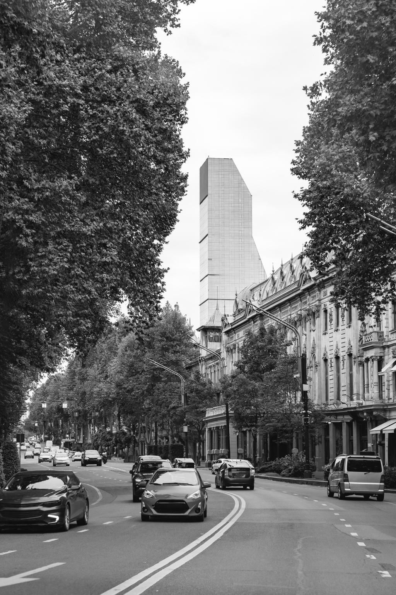
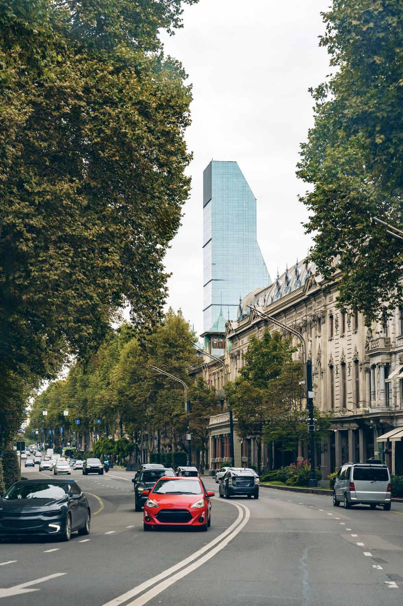
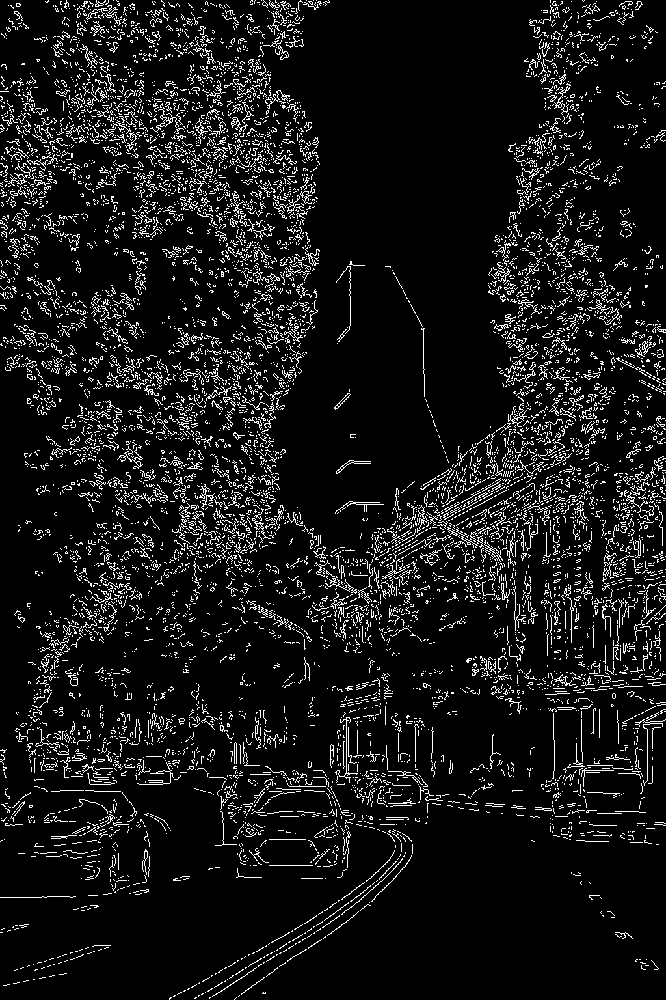
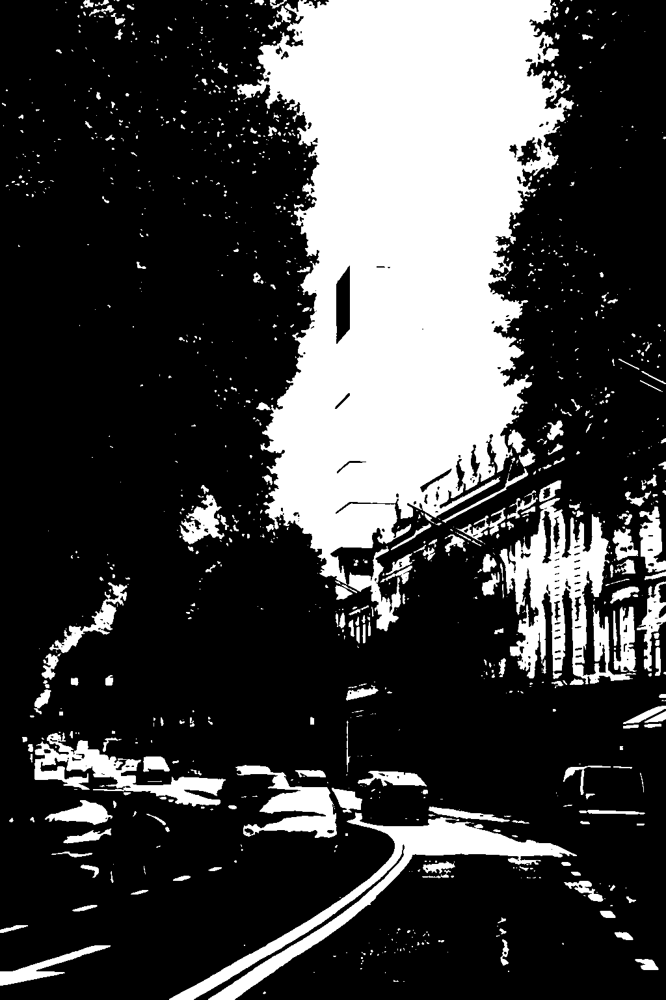
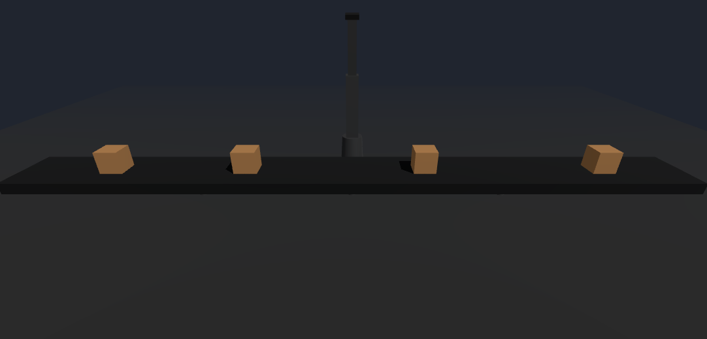
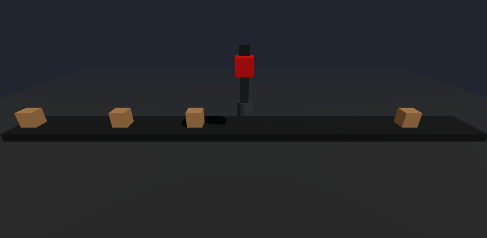

# Examen Final - Computación Visual

Autor: Álvaro Andrés Romero Castro

## Descripción General

Este repositorio contiene la solución al examen final de la asignatura de Computación Visual, compuesto por dos ejercicios que abordan conceptos fundamentales de visión por computador y gráficos 3D interactivos.

### Ejercicio 1: Procesamiento Visual

Implementa un pipeline de procesamiento de imágenes utilizando OpenCV, permitiendo aplicar diferentes técnicas de transformación, filtrado, detección de bordes y segmentación sobre una imagen de entrada.

Las operaciones desarrolladas incluyen:

* Conversión a escala de grises.
* Conversión al espacio de color HSV.
* Aplicación de suavizado mediante desenfoque gaussiano.
* Detección de bordes.
* Segmentación binaria.

### Ejercicio 2: Escena 3D Interactiva

Implementa una simulación de una línea de producción automática utilizando Three.js.

La escena incluye:

* Cinta transportadora animada.
* Objetos en movimiento.
* Brazo robótico articulado.
* Detección de interacción mediante raycasting.
* Sistema de descarte de objetos defectuosos.
* Control de pausa y navegación libre de cámara.

El objetivo general del repositorio es demostrar la aplicación práctica de técnicas de procesamiento digital de imágenes y gráficos computacionales en tiempo real.

---

## Dependencias

### Ejercicio 1 – Procesamiento Visual

* Python 3.10 o superior
* OpenCV
* NumPy

Instaladas mediante:

```bash
pip install -r requirements.txt
```

### Ejercicio 2 – Escena 3D Interactiva

* Node.js 18 o superior
* npm
* Three.js
* Vite

Instaladas mediante:

```bash
npm install
```

---

## Instalación

### Clonar repositorio

```bash
git clone https://github.com/ALVAROCA-0/examen-final-computacion-visual-alvaro-romero.git
cd examen-final-computacion-visual-alvaro-romero
```

### Configuración del Ejercicio 1

```bash
cd ejercicio_1_procesamiento_visual/src

pip install -r requirements.txt
```

### Configuración del Ejercicio 2

```bash
cd ejercicio_2_escena_3d_interactiva/src

npm install
```

---

## Ejecución

### Ejercicio 1 – Procesamiento Visual

Desde:

```bash
ejercicio_1_procesamiento_visual/src
```

Ejecutar:

```bash
python main.py
```

El programa procesará la imagen ubicada en:

```text
data/im_ej.png
```

y almacenará los resultados en:

```text
resultados/
```

### Ejercicio 2 – Escena 3D Interactiva

Desde:

```bash
ejercicio_2_escena_3d_interactiva/src
```

Ejecutar:

```bash
npm run dev
```

Abrir en el navegador la dirección indicada por Vite (normalmente):

```text
http://localhost:5173
```

Controles:

* Mouse: rotar y desplazar cámara.
* Scroll: zoom.
* Click sobre una caja: marcar como defectuosa.
* Barra espaciadora: pausar/reanudar simulación.

---

## Estructura del Repositorio

```text
examen-final-computacion-visual-alvaro-romero
│
├── ejercicio_1_procesamiento_visual
│   ├── data
│   │   └── im_ej.png
│   │
│   ├── resultados
│   │   ├── gray.png
│   │   ├── hsv.png
│   │   ├── blur.png
│   │   ├── edges.png
│   │   └── segmented.png
│   │
│   ├── src
│   │   ├── main.py
│   │   └── requirements.txt
│   │
│   └── README.md
│
├── ejercicio_2_escena_3d_interactiva
│   ├── media
│   │   ├── evidencia_1.png
│   │   ├── evidencia_2.png
│   │   └── evidencia_3.gif
│   │
│   ├── src
│   │   ├── public
│   │   ├── src
│   │   │   ├── main.js
│   │   │   ├── counter.js
│   │   │   └── style.css
│   │   │
│   │   ├── index.html
│   │   ├── package.json
│   │   └── package-lock.json
│   │
│   └── README.md
│
└── .gitignore
```

---

## Evidencias

### Ejercicio 1 – Procesamiento Visual

Se generaron automáticamente las siguientes salidas:

| Resultado     | Descripción                   |
| ------------- | ----------------------------- |
| gray.png      | Conversión a escala de grises |
| hsv.png       | Conversión al espacio HSV     |
| blur.png      | Suavizado gaussiano           |
| edges.png     | Detección de bordes           |
| segmented.png | Segmentación binaria          |

* gray.png:


* hsv.png:


* blur.png:


* edges.png:


* segmented.png:


Estas imágenes permiten comparar visualmente cada etapa del pipeline de procesamiento.

### Ejercicio 2 – Escena 3D Interactiva

Las evidencias se encuentran en:

```text
ejercicio_2_escena_3d_interactiva/media
```

Incluyen:

* Capturas de la escena renderizada.
* Evidencia de interacción con objetos.
* Animación GIF mostrando el funcionamiento completo de la línea de producción.

* Captura básica


* Captura con un Elemento con el que se Interactuó


* GIF mostrando funcionalidad completa


---

## Análisis Técnico

### Procesamiento Visual

La solución implementa un pipeline clásico de visión por computador donde cada transformación modifica progresivamente la representación de la información visual.

1. La conversión a escala de grises reduce la dimensionalidad de la imagen y simplifica operaciones posteriores.
2. La transformación a HSV permite separar información cromática y luminosa.
3. El suavizado gaussiano reduce ruido y pequeñas variaciones locales.
4. La detección de bordes resalta discontinuidades significativas de intensidad.
5. La segmentación genera regiones binarias que facilitan la extracción de objetos.

El flujo evidencia cómo diferentes etapas de preprocesamiento impactan directamente la calidad de los resultados finales.

### Escena 3D Interactiva

La simulación utiliza una arquitectura basada en Three.js y renderizado en tiempo real.

Los componentes principales son:

* Jerarquías de transformación para el brazo robótico.
* Animaciones controladas mediante el ciclo de render.
* Raycasting para interacción usuario-objeto.
* Máquina de estados para controlar el ciclo de vida de las cajas.
* Simulación simplificada de físicas para el descarte de objetos defectuosos.

La integración de estos elementos permite representar un entorno industrial interactivo con comportamiento autónomo y respuesta a eventos del usuario.

En conjunto, ambos ejercicios demuestran la aplicación práctica de conceptos fundamentales de computación visual tanto en el análisis de imágenes como en la generación de entornos tridimensionales interactivos.

## Uso de IA

Se usó IA en el primer punto para reducir el tiempo de ejecución
